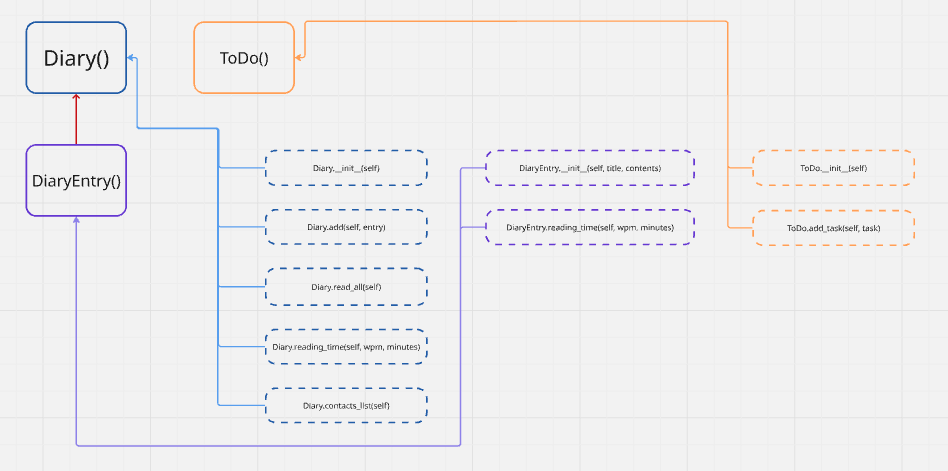

# Design and Test Drive a Multi-Class Program

## User Stories
### User Story 1
>As a user      
>So that I can record my experiences
>I want to keep a regular diary

### User Story 2
>As a user      
>So that I can reflect on my experiences        
>I want to read my past diary entries

### User Story 3
>As a user      
>So that I can reflect on my experiences in my busy day     
>I want to select diary entries to read based on how much time I have and my reading speed

### User Story 4
>As a user      
>So that I can keep track of my tasks       
>I want to keep a todo list along with my diary

### User Story 5
>As a user      
>So that I can keep track of my contacts        
>I want to see a list of all of the mobile phone numbers in all my diary entries

## Class Hierarchy 


## Class Interfaces
```python
class ToDo:
    def __init__(self):
        # Parameters:
        #   None
        # Returns:
        #   Nothing
        # Side Effects:
        #   None
        # Internal State:
        #   self.task_list = [] : empty list to store tasks
        pass

    def add_task(self, task):
        # Parameters:
        #   task: string
        # Returns:
        #   Nothing
        # Side Effects:
        #   adds task to self.task_list
        # Internal State:
        #   N/A
        pass
```

```python
class Diary:
    def __init__(self):
        # Parameters:
        #   None
        # Returns:
        #   Nothing
        # Side Effects:
        #   None
        # Internal State:
        #   self.diary_entries = [] : empty list to store instances of DiaryEntry
        #   self.contacts_list = [] : empty list to store contacts information
        pass

    def add(self, entry):
        # Parameters:
        #   entry: an instance of DiaryEntry
        # Returns:
        #   Nothing
        # Side Effects:
        #   Adds an instance of DiaryEntry to self.dairy_entries
        pass

    def read_all(self):
        # Parameters:
        #   None
        # Returns:
        #   A list of DiaryEntry instances
        pass

    def read_entries(self, wpm, minutes):
        # Parameters:
        #   wpm: int representing words per minute user can read
        #   minutes: int representing how long user has to read
        # Returns:
        #   An instance of DiaryEntry that is closest too and does not exceed  minutes given
        pass
    
    def contacts_list(self):
        # Parameters:
        #   None
        # Returns:
        #   A list of contacts
        pass
```

```python
class DiaryEntry:
    def __init__(self, title, contents):
        # Parameters:
        #   title: string
        #   contents: string
        pass

    def reading_time(self, wpm, minutes):
        # Parameters:
        #   wpm: int representing reading words per minute
        #   minutes: int representing how many minutes the reader has
        # Returns:
        #   An integer representing how long it will take to read the contents of DiaryEntry
        pass
```
